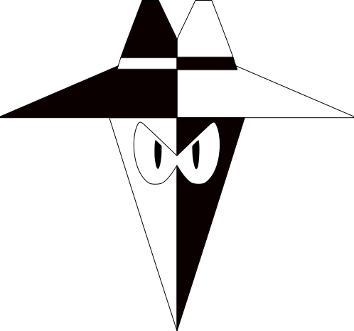
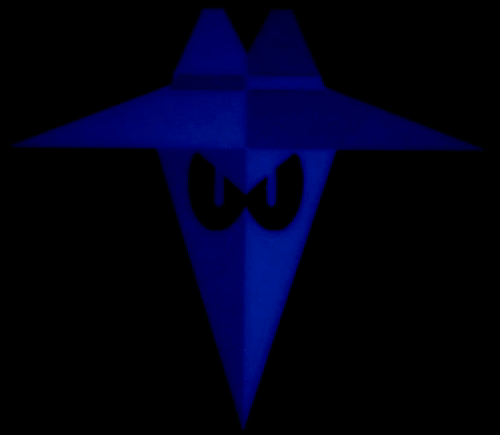

Spy vs Spy Fan Art
===

Fan art designed around the classic Mad magazine Spy vs Spy comic. Made for my niece who wants to be a spy and is currently all about 'spy stuff'. 

Included
---
* .png image
* .stl file

Photos
---

Source image and Glow in the dark blue print shown.

|  |   
| --- | ---

Print Execution
---
No special print settings required.

### Settings
| Print Setting | Value |
| --- | --- |
| Material | PLA |
| Layer Height | 0.2 |

Appendix
---
Related Link to Decoder and spy template

  * [Shift Decoder Spy Template](https://github.com/NHiggs/3DPrint_Shift_Decoder/blob/master/docs/)
  * [Shift Decoder Repo](https://github.com/NHiggs/3DPrint_Shift_Decoder)
